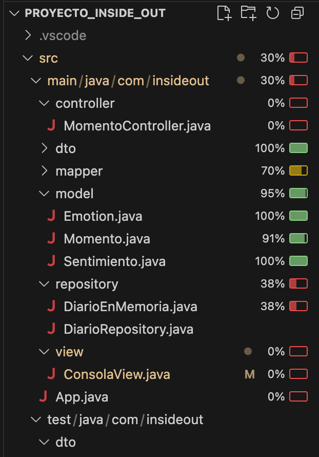
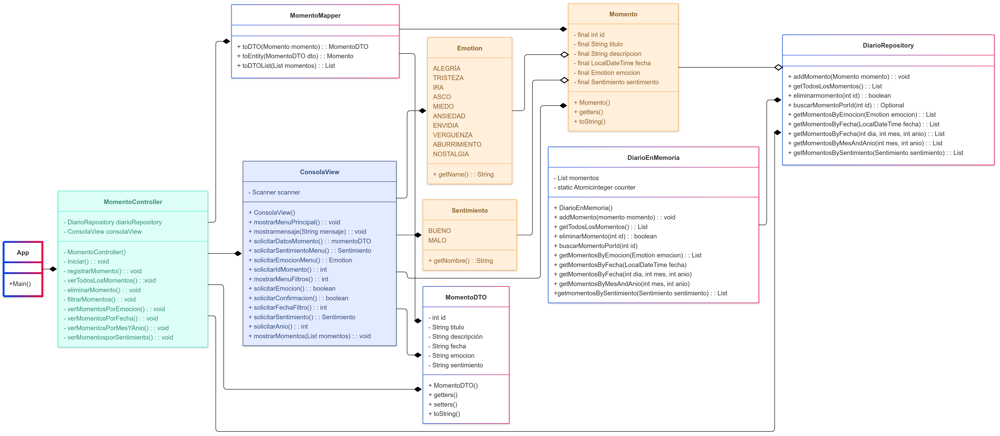

# Inside Out: Diario de Emociones

## Autor: Paula Apsé

Este proyecto es una aplicación de consola en Java que funciona como un diario personal. Permite a los usuarios registrar, consultar y gestionar sus "momentos" diarios, incluyendo la fecha, un título, una descripción, la emoción principal asociada y si fue una experiencia buena o mala. La aplicación está diseñada para ser una herramienta sencilla y efectiva para la autorreflexión y el registro de emociones.

## Pre-requisitos

Para poder ejecutar el proyecto, es necesario tener instalado:

    * Java Development Kit (JDK): El proyecto está construido con Java 21, requiere el entorno de desarrollo para compilar y ejecutar el código.

    * Extension Pack for Java en VS Code: Es un paquete de extensiones que incluye soporte para Java, Maven, Debugger, etc.

    * Apache Maven: Se utiliza como una herramienta de construcción y gestión de dependencias. Maven se encargará de descargar y gestionar automáticamente las librerías de terceros necesarias para el proyecto.

    * JUnit 5 y Hamcrest: Son librerías que se utilizan para crear y ejecutar las pruebas unitarias, son un requisito fundamental para el correcto funcionamiento de los tests.

Según el avance del proyecto, no fue necesaria la instalación de APIs, plugins ni de dependencias adicionales.

## Imagen cobertura de Test


## Images Diagrama de Clase


## 🚀 Diagrama de clases


```mermaid

---
config:
  theme: mc
  layout: elk
---
classDiagram 
direction LR
    class DiarioEnMemoria {
	    - List momentos
	    - static Atomicinteger counter
	    + DiarioEnMemoria()
	    + addMomento(momento momento) : void 
	    + getTodosLosMomentos() : List
	    + eliminarMomento(int id) : boolean
	    + buscarMomentoPorId(int id)
	    + getMomentosByEmocion(Emotion emocion) : List
	    + getMomentosByFecha(LocalDateTime fecha)
	    + getMomentosByFecha(int dia, int mes, int anio)
	    + getMomentosByMesAndAnio(int mes, int anio)
	    +getmomentosBySentimiento(Sentimiento sentimiento) : List
    }
    class DiarioRepository {
	    + addMomento(Momento momento) : void
	    + getTodosLosMomentos() : List
	    + eliminarmomento(int id) : boolean
	    + buscarMomentoPorId(int id): Optional
	    + getMomentosByEmocion(Emotion emocion) : List
	    + getMomentosByFecha(LocalDateTime fecha) : List
	    + getMomentosByFecha(int dia, int mes, int anio) : List
	    + getMomentosByMesAndAnio(int mes, int anio) : List
	    + getMomentosBySentimiento(Sentimiento sentimiento) : List
    }
    class Momento {
	    - final int id
	    - final String titulo
	    - final String descripcion
	    - final LocalDateTime fecha
	    - final Emotion emocion
	    - final Sentimiento sentimiento
	    + Momento()
	    + getters()
	    + toString()
    }
    class ConsolaView {
	    - Scanner scanner
	    + ConsolaView()
	    + mostrarMenuPrincipal() : void
	    + mostrarmensaje(String mensaje) : void
	    + solicitarDatosMomento() : momentoDTO
	    + solicitarSentimientoMenu() : Sentimiento
	    + solicitarEmocionMenu() : Emotion
	    + solicitarIdMomento() : int
	    + mostrarMenuFiltros() : int
	    + solicitarEmocion() : boolean
	    + solicitarConfirmacion() : boolean
	    + solicitarFechaFiltro() : int
	    + solicitarSentimiento() : Sentimiento
	    + solicitarAnio() : int
	    + mostrarMomentos(List momentos) : void
    }
    class App {
	    +Main()
    }
    class Emotion {
	    ALEGRÍA
	    TRISTEZA
	    IRA
	    ASCO
	    MIEDO
	    ANSIEDAD
	    ENVIDIA
	    VERGUENZA
	    ABURRIMIENTO
	    NOSTALGIA
	    + getName() : String
    }
    class Sentimiento {
	    BUENO
	    MALO
	    + getNombre() :String
    }
    class MomentoDTO {
	    - int id
	    - String titulo
	    - String descripción
	    - String fecha
	    - String emocion
	    - String sentimiento
	    + MomentoDTO()
	    + getters()
	    + setters()
	    + toString()
    }
    class MomentoMapper {
	    + toDTO(Momento momento) : MomentoDTO
	    + toEntity(MomentoDTO dto) : Momento
	    + toDTOList(List momentos) : List
    }
    class MomentoController {
	    - DiarioRepository diarioRepository
	    - ConsolaView consolaView
	    - MomentoController()
	    - Iniciar() : void
	    - registrarMomento() : void
	    - verTodosLosMomentos() :void
	    - eliminarMomento() : void
	    - filtrarMomentos() : void
	    - verMomentosPorEmocion() : void
		  - verMomentosPorFecha () : void
		  - verMomentosPorMesYAnio() : void
	    - verMomentosporSentimiento() : void
    }

    MomentoController --* ConsolaView
    MomentoController --* DiarioRepository
    DiarioEnMemoria --* DiarioRepository
    Emotion --o Momento
    Sentimiento --o Momento
    ConsolaView --* Emotion
    ConsolaView --* Sentimiento
    ConsolaView --* Momento
    ConsolaView --* MomentoDTO
    MomentoController --* MomentoDTO
    Momento --o DiarioRepository
    MomentoController --* MomentoMapper
    MomentoMapper --* Momento
    MomentoMapper --* MomentoDTO
    App --* MomentoController

	class Momento:::Peach
	class ConsolaView:::Sky
	class App:::Class_02
	class Emotion:::Ash
	class Emotion:::Peach
	class Sentimiento:::Peach
	class MomentoController:::Aqua

	classDef Ash :,stroke-width:1px, stroke-dasharray:none, stroke:#999999, fill:#EEEEEE, color:#000000
	classDef Peach :,stroke-width:1px, stroke-dasharray:none, stroke:#FBB35A, fill:#FFEFDB, color:#8F632D
	classDef Sky :,stroke-width:1px, stroke-dasharray:none, stroke:#374D7C, fill:#E2EBFF, color:#374D7C
	classDef Aqua :,stroke-width:1px, stroke-dasharray:none, stroke:#46EDC8, fill:#DEFFF8, color:#378E7A
	classDef Class_02 :,stroke-width:4px, stroke-dasharray: 0
	classDef Class_03 :,stroke-width:4px, stroke-dasharray: 5


    ```


